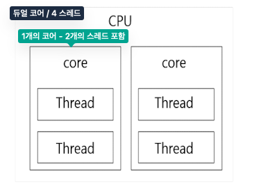
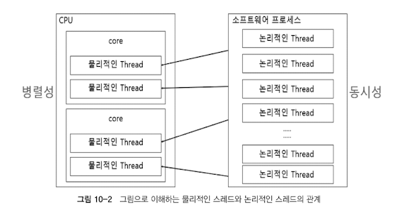

# Chapter 10. Scheduler

## 10.1. 스레드 (Thread) 의 개념 이해
- 물리적인 스레드 == 논리적인 코어
  - 
  - 2개의 스레드는 물리적인 코어를 `논리적` 으로 나눈 것 == 물리적인 코어를 논리적으로 나눈 코어 == **물리적인 스레드**
- **논리적인 스레드** == 소프트웨어적으로 생성되는 스레드 (java 프로그래밍에서 사용되는 스레드)
  - 이론적으로 메모리 허용되는 범위 내에서 무한 생성 가능, but 물리적인 스레드의 가용 범위 내에서 실행됨
- 
  - 병렬성 : 물리적인 스레드가 실제 동시 실행되기에 여러 작업을 동시에 처리함을 의미한다
  - 동시성 : 동시에 실행되는 것처럼 보이는 것. 많은 논리적 스레드가 4개의 물리적인 스레드를 빠른 속도로 번갈아가며 사용하면서 마치 동시에 실행되는 것처럼 보이게 한다

## 10.2. Scheduler 란?
- Reactor 의 Scheduler 는 비동기 프로그래밍을 위해 사용되는 **스레드를 관리해주는 역할**
  - Scheduler 를 사용하여 **어떤 스레드에서 무엇을 처리할 지 제어함**

## 10.3. Scheduler 를 위한 전용 Operator
- `subscribeOn`: 구독 발생 직후 실행될 `스레드`를 지정하는 Operator
  - 구독 발생 시 원본 Publisher 가 데이터를 최초 emit 하므로, **원본 publisher 동작을 수행하기 위한 스레드**로 볼 수 있음
- `doOnSubscribe` : 구독 발생 시점에 추가적인 처리 필요할 시 해당 처리 동작을 추가할 수 있음
- `publishOn` : downstream 으로 signal 을 전송할 때 실행되는 스레드를 제어하는 역할을 하는 Operator
  - publishOn() 기준으로 **아래 쪽 downstream 의 실행 스레드를 변경**
- **subscribeOn(), publishOn() 은 동시성을 가지는 논리적인 스레드에 해당.**
- `parallel`  은 병렬성을 갖는 물리적인 스레드에 해당됨
  - 라운드로빈 방식으로 CPU 코어 개수 (=물리적인 스레드 == 물리적 코어 개수가 아니라 논리적으로 나눈 코어) 만큼 스레드를 병렬 실행
  - 이 operator 은 emit 되는 데이터를 CPU 의 논리적인 코어 (=물리적 스레드) 수에 맞게 분배하는 역할만 담당
  - `runOn` : 실제 병렬 작업을 수행할 스레드 할당을 담당

## 10.4. publishOn() 과 subscribeOn() 의 동작 이해
- operator 체인 상에서 1개 이상의 publishOn() 을 사용하여 **실행 스레드를 목적에 맞게 적절히 분리할 수 있다**
- subscribe() Operator / publishOn() Operator를 함께 사용 시, **원본 Publisher에서 데이터를 emit하는 스레드와 emit된 데이터를 가공 처리하는 스레드를 적절하게 분리할 수 있음**

## 10.5. Scheduler 의 종류
- `Schedulers.immediate` : 별도 스레드 추가 생성 없이, 현재 스레드에서 작업을 처리하고자 할 때 사용
- `Schedulers.single` : 스레드 하나만 생성해서 Scheduler 가 제거되기 전까지 재사용
- `Schedulers.newSingle` : 호출할 때마다 매번 새로운 스레드 생성
- `Schedulers.boundedElastic` : ExecutorService 기반의 스레드 풀 Thread Pool 생성 -> 그 안에서 정해진 수만큼의 스레드를 사용하여 작업을 처리하고 작업이 종료된 스레드는 반납하여 재사용하는 방식
  - **Blocking I/O 작업을 효과적으로 처리하기 위한 방식**
- `Schedulers.parallel` : Non-Blocking I/O에 최적화되어 있는 Scheduler로서 **CPU 코어 수만큼의 스레드를 생성**