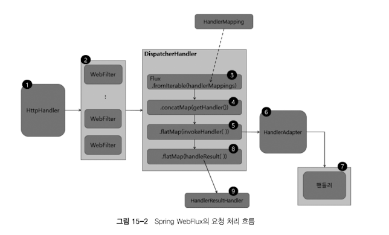
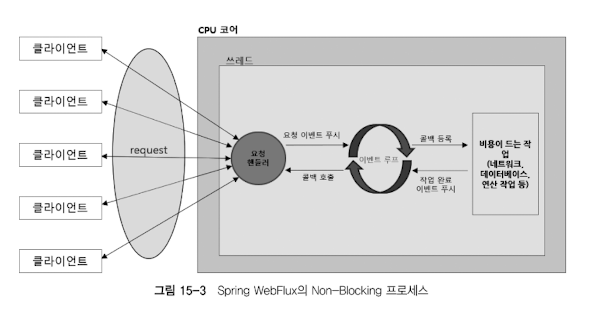

# Chapter 15. Spring WebFlux 개요
## 15.1. Spring WebFlux 의 탄생 배경
- Spring WebFlux : 리액티브 웹 애플리케이션 구현을 위해 Spring 5.0 부터 지원하는 리액티브 웹 프레임워크
- **적은 수의 스레드로, 대량의 요청을, 안정적으로 ! 처리할 수 있는 비동기 Non-Blocking I/O 방식**

## 15.2. Spring WebFlux 의 기술 스택
- 서버
  - Spring MVC : 서블릿 기반 프레임워크이므로, 아파치 톰캣 같은 서블릿 컨테이너에서 Blocking I/O 방식으로 동작
  - Spring WebFlux : **Non-Blocking I/O 방식으로 동작하는 Netty 등의 서버엔진에서 동작**
- 서버 API
  - Spring MVC : 서블릿 기반 프레임워크이므로, 서블릿 API 사용
  - Spring WebFlux : 기본 서버 엔진이 Netty 이지만 Jetty 나 Undertow 같은 서버 엔진에서 지원하는 리액티브 스트림즈 어댑터를 통해 리액티브 스트림즈 지원
- 데이터 액세스
  - Spring WebFlux 는 데이터 액세스 계층까지 완벽히 Non-Blocking I/O 지원하도록, **Spring Data R2DBC 및 Non-Blockig I/O 지원하는 NoSQL 모듈 사용**

## 15.3. Spring WebFlux 의 요청 처리 흐름

1. 최초 클라이언트 요청 시, Netty 등의 서버 엔진을 거쳐 `HttpHandler` 가 들어오는 요청을 전달받음
   - HttpHandler : 다양한 서버 엔진에서 지원하는 서버 API 를 사용할 수 있도록 추상화해주는 역할
     - 다른 유형의 HTTP 서버 API 로 request, response 를 처리하기 위해 추상화된 단 하나의 메서드를 가짐
   - ServerWebExchange 생성 후 WebFilter 체인으로 전달
     - 파라미터로 전달받은 WebFilterChain 을 통해 필터 체인 형성 -> 원하는 만큼 WebFilter 추가 가능
   - `HandlerFilterFunction` : 함수형 기반 요청 핸들러에 적용 가능한 Filter
     - WebFilter 구현체는 스프링 빈으로 등록되나, HandlerFilterFunction 구현체는 스프링 빈으로 등록되지 않음 (애너테이션 기반 핸들러가 아니라, 함수형 기반 요청 핸들러에서 함수 형태로 사용되므로)
2. ServerWebExchange 는 WebFilter 체인에서 전처리 과정 거친 후, WebHandler 인터페이스 구현체인 DispatcherHandler 에게 전달됨
3. `DispatcherHandler` 는 HandlerMapping List 를 원본 Flux 소스로 전달받음
   - Spring MVC 에서 Front Controller 패턴이 적용된 DispatcherServlet 처럼 중앙에서 먼저 요청을 전달받은 후, 다른 컴포넌트에 요청처리 위임
4. ServerWebExchange 를 처리할 핸들러 조회
5. 조회한 핸들러 호출을 `HandlerAdapter` 에게 위임
6. HandlerAdapter 는 ServerWebExchange 를 처리할 핸들러 호출
    - HandlerMapping 을 통해 얻은 핸들러를 직접적으로 호출하는 역할
7. 핸들러에서 요청 처리 후 응답 리턴
8. 리턴받은 응답 데이터 처리할 `HandlerResultHandler` 조회
9.  HandlerResultHandler 가 응답 데이터 처리 후 response 리턴

## 15.5. Spring WebFlux 의 Non-Blocking 프로세스 구조
- Blocking I/O 방식의 Spring MVC 는 **요청 처리하는 스레드가 차단될 수 있기 때문에, 기본적으로 대용량 스레드 풀을 사용해서 하나의 요청을 하나의 스레드가 처리함**
- Non-Blocking I/O 방식의 Spring WebFlux 는 스레드가 차단되지 않기 때문에, **적은 수의 고정된 스레드 풀을 사용해서 더 많은 요청을 처리함**
  - 스레드 차단 없이 더 많은 요청 처리할 수 있는 이유 : 요청 처리 방식이 `이벤트 루프` 방식이기 때문 !

1. 클라이언트로부터 들어오는 요청을 요청 핸들러가 받음
2. 전달받은 **요청을 이벤트 루프에 푸시**
3. 이벤트 루프는 네트워크, 데이터베이스 연결 작업 등 비용 드는 작업에 대한 **콜백 등록**
4. 작업 완료 시, 완료 이벤트를 이벤트 루프에 푸시
5. 등록한 콜백 호출해 처리 결과 전달
- 이벤트 루프는 단일 스레드에서 계속 실행되며, 이벤트 발생 시 해당 이벤트에 대한 콜백 등록함과 동시에 다음 이벤트 처리로 넘어감

## 15.6. Spring WebFlux 의 스레드 모델
- Non-Blocking I/O 를 지원하는 Netty 등의 서버 엔진에서 **적은 수의 고정된 크기 스레드 (= 일반적으로 CPU 코어 개수만큼의 스레드 생성)**ß