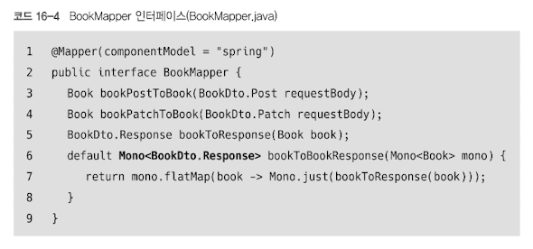

# Chapter 16. 애너테이션 기반 컨트롤러 (Annotated Controller)
 
## 16.2. Spring WebFlux 기반 Controller

```java
public Mono postBook(@RequestBody BookDto.Post requestBody) {
  // 1. 여기서 mapper가 동작할 때까지 스레드는 다음 줄로 못 넘어감 (Blocking)
  Mono<Book> book = bookService.createBook(mapper.bookPostToBook(requestBody));
  Mono<BookDto.Response> response = mapper.bookToBookResponse(book);
  return response;
}
```
- bookService.createBook()을 호출하기 직전에 mapper.bookPostToBook(requestBody)가 실행됨
- 따라서 비동기 파이프라인(Mono)이 생성되기도 전에 CPU가 매핑 작업에 붙들려 있는 구조

```java
public Mono postBook(@RequestBody Mono<BookDto.Post> requestBody) {
  // 1. 데이터를 Mono(상자) 통째로 넘김. 아직 변환 안 함.
  Mono<Book> result = bookService.createBook(requestBody);

  // 2. 나중에 데이터가 도착하면(flatMap) 그때 변환하라고 '예약'만 함.
  return result.flatMap(book -> Mono.just(mapper.bookToResponse(book)));
}
```
- 이점
  - 컨트롤러의 스레드는 매핑을 기다리지 않고 즉시 해제되어 다른 요청을 처리하러 떠날 수 있음
  - 실제 매핑은 데이터가 준비되었을 때 리액티브 파이프라인 안에서 효율적으로 실행됨